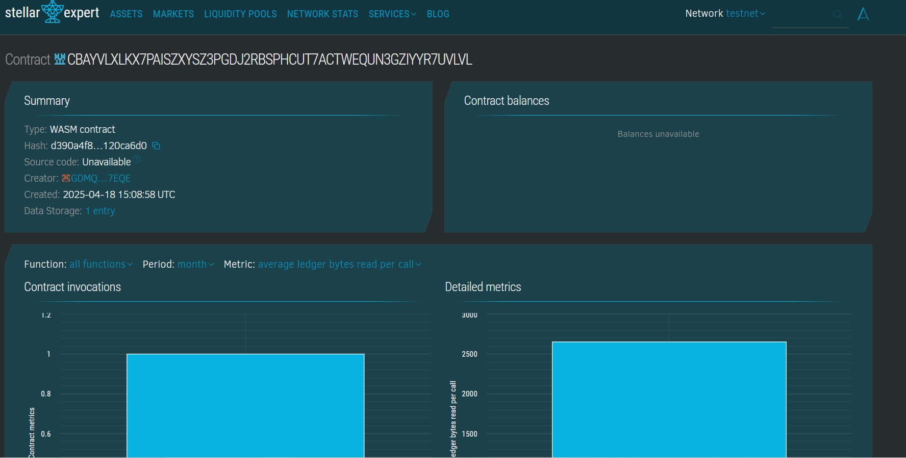

# Student Report Card on Chain

## Project Description
A decentralized system for storing and managing student report cards on the blockchain using Soroban smart contracts. The project ensures transparency, security, and immutability in academic record-keeping.

## Project Vision
To create a tamper-proof, easily accessible, and trustless academic record management system where students, institutions, and authorized parties can interact with report cards in a secure and decentralized way.

## Key Features

- **Immutable Storage**: Once added, records are securely stored on-chain.
- **CRUD Operations**: Admins can create, read, update, and delete student report cards.
- **Simple Interface**: Minimal and efficient smart contract functions.
- **Access Transparency**: Records can be transparently verified on-chain. 
## Future Scope there no scope there is new future
- **Role-Based Access Control**: Introduce permissions for schools/admins.
- **Transcript Aggregation**: Support multiple subjecthhhs and terms per student.
- **NFT Issuance**: Link report cards to NFTs for proof of achievement.
- **Analytics**: On-chain insights for academic performance trends.
- **Decentralized Frontend**: UI integration using Stellar's Soroban frontend tools.
## Contract Details
CBAYVLXLKX7PAISZXYSZ3PGDJ2RBSPHCUT7ACTWEQUN3GZIYYR7UVLVL

wai